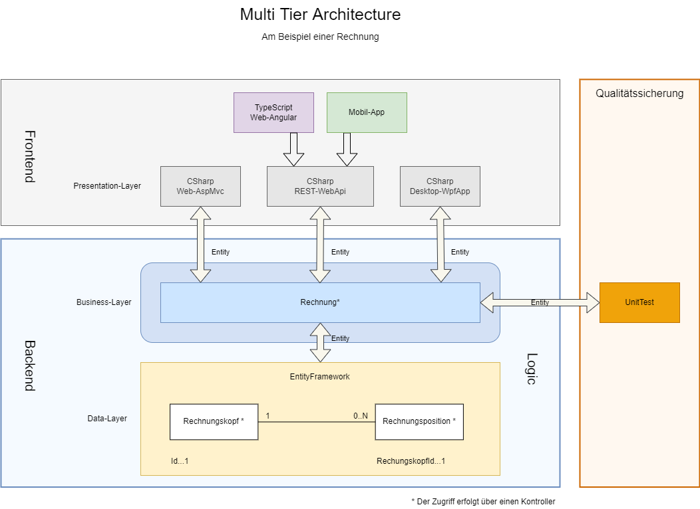

Multi Tier Architecture  
=======================  
  
Die ***Multi Tier Architecture*** ist ein sehr häufig angewandtes Strukturmuster für die Architektur von Softwaresystemen. Das ***QTCityCongestionCharge*** implementiert ebenfalls diese Struktur. Die Struktur beinhaltet im Wesentlichen die 3 Schichten  
  
- Präsentationsschicht,  
- Geschäftslogik,  
- und die Datenlogik.  
  
## Datenlogik  
  
Auf der Datenebene werden alle datentechnischen Belangen abgebildet. Dazu gehören die Tabellen von Entitäten, deren Beziehungen und die Eigenschaften der Spalten (mandatory, Größen usw.). Im Falle einer Rechnung werden auf der Datenbank zwei Tabellen, ***Rechnungskopf*** und ***Rechnungsposition***, benötigt. Diese Tabellen sind über eine Fremdschlüssel Beziehung miteinander verknüpft und bilden somit eine **1:N-Beziehung**. Diese bedeutet, dass einem ***Rechnungskopf*** beliebig viele ***Rechnungspositionen*** zugeordnet sein können(beliebig bedeutet 0..n).  
Das **Datensystem** sorgt dafür, dass die Fremdschlüsselbeziehung eingehalten wird, dass erforderliche Werte (Not Null) definiert werden und die Größen der Datenwerte nicht überschritten werden. Alle **Geschäftsregeln**, welche auf die Datenebene übertragen werden können, sollen auch auf diesem System abgebildet werden. Dies hat den Vorteil, dass die Daten in letzter Instanz überprüft und validiert werden können.  
  
## Geschäftslogik  
  
Im Bereich der Domänenschicht werden grundsätzliche alle **Logik-Regeln** umgesetzt, welche von der Datenschicht nicht umgesetzt werden können. Dazu gehört die Regel - in unserem Beispiel der Rechnung, dass nur Rechnungen mit **mindestens** einer **Rechnungsposition** im System vorhanden sein dürfen. Diese **Regel** ist schwierig bis unmöglich auf der Datenschicht abbildbar und sollte daher in der darüberliegenden Ebene umgesetzt werden. Dies setzt allerdings voraus, dass alle Aktionen über den **Business-Layer** erfolgen. Aus diesem Grund muss die Architektur so konzipiert sein, dass der Zugriff auf die beiden Kontroller **Rechnungskopf** und **Rechnungsposition** außerhalb des Projektes ***Invoice.Logic*** geschützt sein muss.  
  
## Präsentationsschicht  
  
In der Präsentationsschicht befinden sich in den meisten Fällen viele unterschiedliche Anwendungen welche, auf den Backend zugreifen. Diese können vom physikalischen Aufbau sehr unterschiedlich sein. So gibt es Klienten welche ebenfalls in CSharp implementiert worden sind. Dadurch ergibt sich die Möglichkeit, dass diese Anwendungen direkt auf den Backend zugreifen können. Es gibt aber auch Endgeräte die nicht in CShrap implememntiert worden sind oder keine Möglichkeit des direkten Zugriffs auf das Backend haben (z.B.: Handy). Für den indirekten Zugriff auf das Backend gibt es einen REST Service. Dieser erlaubt einen Zugriff über das HTTP-Protokoll. Mit diesem Service ergibt sich ein uneingeschränkter Zugriff auf den Backend.  
  
In der nachfolgenden Abbildung ist die Architektur schematisch dargestellt:   
  
  
  
